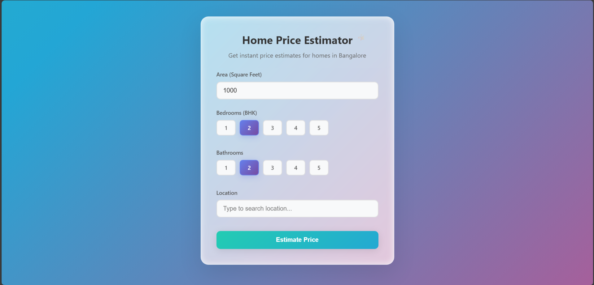
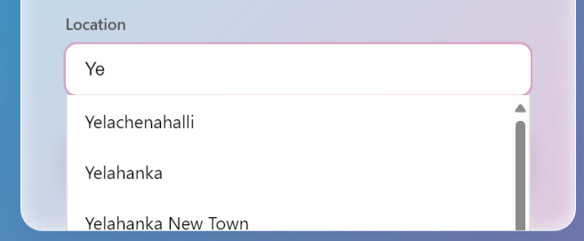
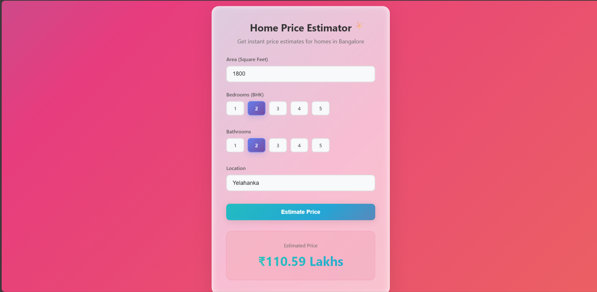

# 🏠 Bangalore Home Price Predictor

A machine learning web application that predicts home prices in Bangalore based on location, size, bedrooms, and bathrooms. Built with Flask, scikit-learn, and modern web technologies.


## 🌟 Features

- **Smart Location Search**: Autocomplete functionality with 240+ Bangalore locations
- **Instant Predictions**: Get real-time price estimates based on:
  - Area (Square Feet)
  - Number of Bedrooms (BHK)
  - Number of Bathrooms
  - Location
- **Modern UI**: Clean, responsive design with animated gradients
- **RESTful API**: Well-structured backend with multiple endpoints

## 🚀 Live Demo

- **App**: [https://blrhomepriceestimator.netlify.app/](https://blrhomepriceestimator.netlify.app/)
- **API**: [https://pranavpa.pythonanywhere.com](https://pranavpa.pythonanywhere.com)

## 📸 Screenshots

<details>
<summary>Click to view screenshots</summary>

### Home Page
 

### Autocomplete Search
 

### Price Prediction
 

</details>

## 🛠️ Tech Stack

### Backend
- **Flask** - Web framework
- **scikit-learn** - Machine learning model
- **NumPy** - Numerical computations
- **Gunicorn** - Production WSGI server

### Frontend
- **HTML5** & **CSS3** - Modern, responsive design
- **JavaScript (ES6)** - Dynamic interactions
- **Fetch API** - Asynchronous API calls

### Deployment
- **Frontend**: Netlify (Continuous deployment from GitHub)
- **Backend**: PythonAnywhere (Free hosting for Python apps)

## 📊 Model Information

The machine learning model was trained on Bangalore home prices dataset with the following features:
- **Input Features**: Location, Size (sqft), Bedrooms, Bathrooms
- **Algorithm**: Linear Regression 
- **Accuracy**: 82%

## 🏃‍♂️ Running Locally

### Prerequisites
- Python 3.8+
- pip package manager

### Installation

1. **Clone the repository**
   ```bash
   git clone https://github.com/pranavpatel08/Bangalore-Home-Price-Estimator.git
   cd Bangalore-Home-Price-Estimator
   ```

2. **Set up the backend**
   ```bash
   cd server
   pip install -r requirements.txt
   ```

3. **Run the Flask server**
   ```bash
   python server.py
   ```
   The API will be available at `http://localhost:5000`

4. **Run the frontend** (in a new terminal)
   ```bash
   cd client
   python -m http.server 8000
   ```
   Open `http://localhost:8000` in your browser

## 📁 Project Structure

```
bangalore-home-price-predictor/
├── client/                     # Frontend application
│   ├── index.html             # Main HTML file
│   ├── app.css                # Styles with animations
│   └── app.js                 # JavaScript logic
├── server/                     # Backend application
│   ├── server.py              # Flask application
│   ├── util.py                # Utility functions
│   ├── requirements.txt       # Python dependencies
│   └── artifacts/             # ML model files
│       ├── columns.json       # Feature columns
│       └── bangalore_RE_Price_model.pickle  # Trained model
└── README.md                  # Project documentation
```

## 🔌 API Endpoints

### Base URL: `https://pranavpa.pythonanywhere.com`

| Endpoint | Method | Description |
|----------|--------|-------------|
| `/` | GET | API health check |
| `/get_location_names` | GET | Get all available locations |
| `/search_locations?query={term}` | GET | Search locations with autocomplete |
| `/predict_home_price` | POST | Predict home price |

### Example API Usage

```javascript
// Predict home price
const formData = new FormData();
formData.append('total_sqft', 1200);
formData.append('location', 'Whitefield');
formData.append('bhk', 2);
formData.append('bath', 2);

fetch('https://pranavpa.pythonanywhere.com/predict_home_price', {
    method: 'POST',
    body: formData
})
.then(response => response.json())
.then(data => console.log(`Estimated Price: ₹${data.estimated_price} Lakhs`));
```

## 🚀 Deployment

### Backend (PythonAnywhere)
1. Create a free account at [pythonanywhere.com](https://pythonanywhere.com)
2. Upload project files
3. Configure Flask application
4. Set up WSGI configuration

### Frontend (Netlify)
1. Connect GitHub repository to Netlify
2. Set build directory to `client`
3. Deploy with automatic HTTPS

## 🤝 Contributing

Contributions are welcome! Please feel free to submit a Pull Request. For major changes, please open an issue first to discuss what you would like to change.

1. Fork the repository
2. Create your feature branch (`git checkout -b feature/AmazingFeature`)
3. Commit your changes (`git commit -m 'Add some AmazingFeature'`)
4. Push to the branch (`git push origin feature/AmazingFeature`)
5. Open a Pull Request

## 👏 Acknowledgments

- Dataset source: [Bengaluru House price data](https://www.kaggle.com/datasets/amitabhajoy/bengaluru-house-price-data)